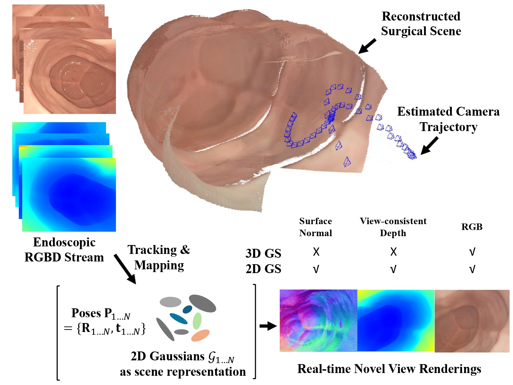
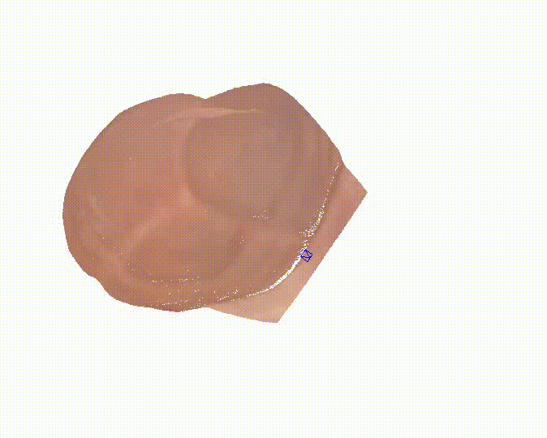

## 
<p align="center">

  <h2 align="center">Endo-2DTAM: Advancing Dense Endoscopic Reconstruction with Gaussian Splatting-driven Surface Normal-aware Tracking and Mapping</h2>
  <div align="center">
    <h4><a href="https://lastbasket.github.io/"><strong>Yiming Huang</strong></a> *, <a href="https://beileicui.github.io/"><strong>Beilei Cui</strong></a> *, <a href="https://longbai-cuhk.github.io/"><strong>Long Bai</strong></a> *, <a href="https://xumengyaamy.github.io/"><strong>Zhen Chen</strong></a>, Jinlin Wu, Zhen Li, Hongbin Liu, <a href="https://www.ee.cuhk.edu.hk/en-gb/people/academic-staff/professors/prof-ren-hongliang"><strong>Hongliang Ren</strong></a> </h3>
    <h3> ICRA 2025 </h2>
    <h3 align="center"> || <a href="https://arxiv.org/pdf/2501.19319">Paper</a> || <a href="https://arxiv.org/abs/2501.19319">Arxiv</a> || </h3>
    <div align="center"></div>
  </div>
  <div align="center"></div>
</p>

<!-- <p align="center">
    
  </a>
</p> -->

<p align="center">
      
  </a>
</p>

### 🛠️ Requirements

You can install them following the instructions below.

  
```bash
conda create -n endo2dtam python=3.10 # recommended
conda activate endo2dtam
# torch and cuda version according to your env and device
pip install torch==1.13.1 torchvision==0.14.1 torchaudio==0.13.1 --extra-index-url https://download.pytorch.org/whl/cu118
pip install -r requirements.txt

git clone https://github.com/hbb1/diff-surfel-rasterization.git
pip install diff-surfel-rasterization

git clone https://gitlab.inria.fr/bkerbl/simple-knn.git
pip install simple-knn
```

Latest version is recommended for all the packages unless specified, but make sure that your CUDA version is compatible with your `pytorch`.

Hardware: Ubuntu20.04+RTX4090

### ⚓ Preparation
We use the [C3VD](https://durrlab.github.io/C3VD/) dataset. You can use the scripts in `data/prepeocess_c3vd` to preprocess the dataset. We also provide the preprocessed dataset by EndoGSLAM: [Google Drive](https://drive.google.com/drive/folders/1wT4cILcbf4TUlWlmK_wJPiIrZ2AqZ43W?usp=drive_link).

After you get prepared, the data structure should be like this:

```
- data/
  |- C3VD/
    |- cecum_t1_b/
      |- color/
      |- depth/
      |- pose.txt
    |- cecum_t3_a/
- scripts/
  |- main.py
- utils/
- other_folders/
- readme.md
```


## Training and Evaluation

```bash
bash slam.sh
```
```bash
bash eval.sh
```
## Cite
```
@article{huang2025advancing,
  title={Advancing Dense Endoscopic Reconstruction with Gaussian Splatting-driven Surface Normal-aware Tracking and Mapping},
  author={Huang, Yiming and Cui, Beilei and Bai, Long and Chen, Zhen and Wu, Jinlin and Li, Zhen and Liu, Hongbin and Ren, Hongliang},
  journal={arXiv preprint arXiv:2501.19319},
  year={2025}
}

```

## Acknowledgements
We would like to acknowledge the following inspiring work:
- [3DGS](https://github.com/graphdeco-inria/gaussian-splatting) (Bernhard Kerbl et al.)
- [2DGS](https://github.com/hbb1/2d-gaussian-splatting) (Huang et al.)
- [SplaTAM](https://github.com/spla-tam/SplaTAM) (Nikhil Keetha et al.)
- [EndoGSLAM](https://github.com/Loping151/EndoGSLAM) (Wang et al.)

